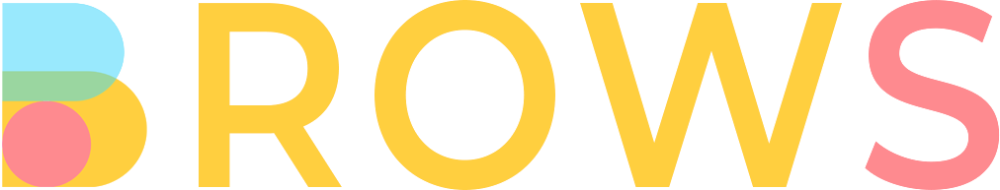

## Tentang BROWS

“BROWS” adalah produk dari PT. TELEKOMUNIKASI INDONESIA, TBK, suatu penyelenggara sistem elektronik berbentuk website dan mobile application yang menjalankan kegiatan usaha aplikasi portal BROWS yakni website dan mobile application pencarian toko dan produk yang di dalamnya memfasilitasi kegiatan sewa menyewa barang antara pihak penyewa dan pihak yang menyewakan.

## Ketentuan Pengguna

- Pengguna dengan ini menyatakan bahwa Pengguna adalah pihak yang cakap dan mampu untuk mengikatkan dirinya dalam sebuah perjanjian yang sah menurut hukum yang berlaku di Republik Indonesia.
- BROWS tidak memungut biaya pendaftaran kepada Pengguna.
- Pengguna wajib mengisi dan menyampaikan Informasi Pribadi yang benar dan lengkap dalam melakukan proses pendaftaran. Kesalahan, ketidakakuratan dan/atau kerancuan dalam Informasi Pribadi Pengguna sepenuhnya merupakan tanggung jawab pribadi Pengguna.
- BROWS tanpa pemberitahuan terlebih dahulu kepada Pengguna, memiliki kewenangan untuk melakukan tindakan yang perlu atas setiap pelanggaran atau dugaan pelanggaran Pengguna atas Syarat dan Ketentuan dan/atau hukum dan peraturan yang berlaku, termasuk namun tidak terbatas pada pencabutan Barang dari aplikasi BROWS, penutupan toko Pengguna, suspensi akun Pengguna, pencabutan akun Pengguna, dan/atau pengakhiran kerjasama dengan Pengguna.
- BROWS memiliki kewenangan untuk melakukan penyesuaian jumlah transaksi toko, penyesuaian jumlah reputasi, dan/atau melakukan proses moderasi/menutup akun Pengguna, jika diketahui atau diduga adanya kecurangan oleh Pengguna yang bertujuan memanipulasi data transaksi Pengguna demi meningkatkan reputasi toko (review dan/atau jumlah transaksi). Contohnya adalah melakukan proses belanja ke toko sendiri dengan menggunakan akun pribadi Pengguna atau akun pribadi lainnya.
- BROWS memiliki kewenangan untuk menutup akun Pengguna, baik sementara (suspensi akun) maupun permanen (pencabutan akun) dalam hal ditemukan adanya tindakan kecurangan dalam bertransaksi dan menggunakan layanan dalam aplikasi BROWS yang ditujukan untuk kepentingan pribadi Pengguna.
- Pengguna memahami dan menyetujui bahwa BROWS dapat sewaktu-waktu menutup akun Pengugna secara sementara maupun secara permanen dalam hal BROWS menerima laporan dari Pengguna lainnya atas perbuatan dan/atau dugaan perbuatan Pengguna yang mengganggu penggunaan aplikasi BROWS oleh Pengguna lainnya, termasuk namun tidak terbatas pada penyalahgunaan akun Pengguna untuk mengganggu Pengguna lain (bullying atau harassment), penipuan, dan/atau tidak dilaksanakannya kewajiban oleh Pengguna sebagai Pemberi Sewa atau Penerima Sewa. Akun Pengguna dapat dikembalikan dan/atau dibuka kembali berdasarkan hasil pemeriksaan dan kebijakan BROWS sepihak.

Terms and Conditions selengkapnya dapat diakses di <a href="https://brows.id/tnc" target="__blank">Terms & Conditions</a> pada website BROWS.

## Pembaharuan dan Perubahan

Syarat dan Ketentuan dapat diubah atau diperbaharui sewaktu-waktu tanpa ada pemberitahuan terlebih dahulu. Pengguna disarankan untuk selalu membaca dan memeriksa Syarat dan Ketentuan secara seksama dari waktu ke waktu untuk mengetahui perubahan apapun. Dengan tetap mengakses dan menggunakan layanan yang tersedia dalam aplikasi BROWS, maka Pengguna dianggap menyetujui perubahan-perubahan dalam Syarat dan Ketentuan.